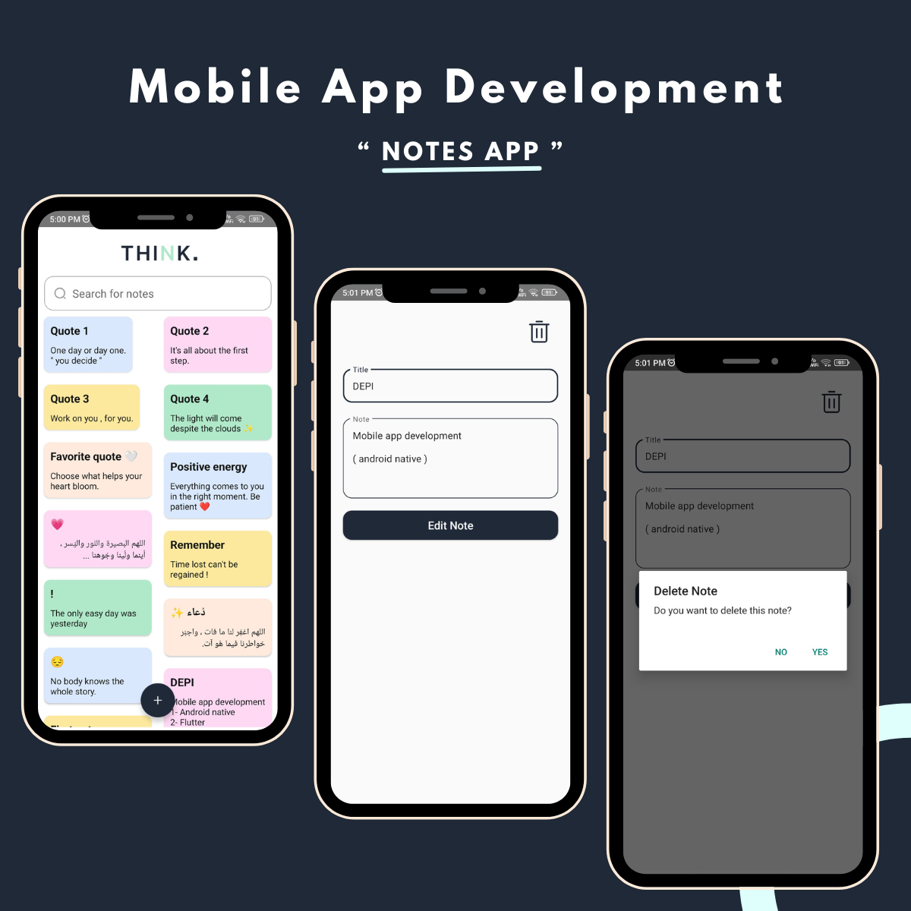

# Notes App 📝

Notes App is a simple yet powerful app that allows users to manage their notes efficiently. With this app, users can:

✅ Add new notes with a title and description  
✅ Edit existing notes easily  
✅ Delete notes when they are no longer needed  
✅ View all notes in a structured list  

## 🔹 Technical Highlights:

- Built using XML for the UI 
- Implemented Room Database for local storage
- Applied the MVVM Architecture to ensure clean, maintainable, and scalable code
- Used LiveData & ViewModel for better state management

##  Screenshot 📸

